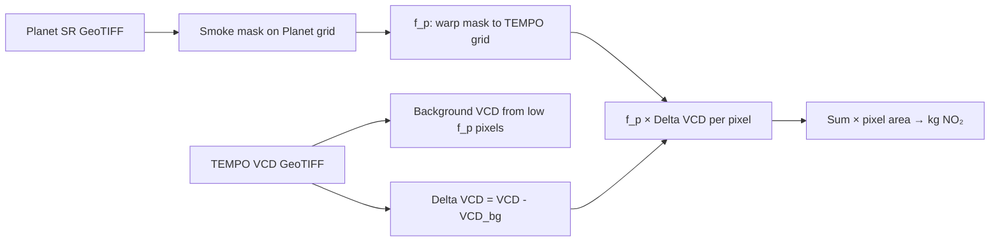

# Smoke plume NO₂ pipeline — a plain-English guide

This page explains **what the code is doing** and **why**, without assuming you speak remote-sensing jargon. For math and symbols, see [PROJECT.md](../PROJECT.md). For knob-by-knob tuning, see [pipeline_tuning_parameters.md](pipeline_tuning_parameters.md).

---

## The one-sentence version

We combine a **sharp photo of smoke** (Planet) with a **coarse map of air pollution** (TEMPO NO₂) to estimate how much **extra nitrogen dioxide** is sitting in the plume—stated as a **mass in kilograms**—after subtracting a “normal clean air” level.

---

## Two satellites, two jobs

| | **Planet (PlanetScope)** | **TEMPO** (NASA, geostationary) |
|---|---------------------------|----------------------------------|
| **What it’s good at** | Seeing **where smoke is** on the ground (meters-scale). | Measuring **NO₂ in the column of air** above the ground (kilometers-scale “pixels”). |
| **Analogy** | A detailed **photo** of the smoke plume. | A **low-resolution weather-style grid** of pollution over a huge area. |
| **Catch** | Planet doesn’t directly give you “kg of NO₂.” | TEMPO doesn’t see smoke shape at fence-line detail. |

The pipeline’s trick is to **merge** them: use Planet to say *how much of each big TEMPO pixel is covered by smoke*, then weight the NO₂ signal accordingly.

---

## The story in five steps (ELI5)

### Step 1 — Line up the moment in time

Wildfires move. Satellites pass at different times. We pick a Planet scene and a TEMPO granule that are **close in time** so we’re not comparing lunch to dinner. Your `case.json` can record those times under `time_match` (see [PROJECT.md](../PROJECT.md)).

### Step 2 — Paint “smoke” on the Planet image

The computer doesn’t “see” smoke the way humans do. It uses **simple spectral rules** on surface reflectance—for example, a **blue vs near-infrared** test— to mark pixels that look like smoke. That produces a **mask**: each Planet pixel is “smoke” or “not smoke” (with invalid areas masked out).

*Nothing here is perfect:* thin cloud, haze, bright dirt, and real smoke can get confused. That’s why there are tuning docs like [smoke_mask_challenges.md](smoke_mask_challenges.md).

### Step 3 — Pour the fine mask into big TEMPO “bins” (**f_p**)

Imagine pouring sand through a sieve:

- Planet pixels are **tiny**.
- TEMPO pixels are **huge**.

For each big TEMPO cell, we ask: *of the tiny Planet pixels inside, what fraction looked like smoke?* That fraction is called **f_p** (overlap fraction). It’s always between **0** and **1**.


If **f_p = 0**, that TEMPO pixel has essentially **no smoke** in it (according to Planet). If **f_p = 0.3**, roughly **30%** of that cell “looks like smoke” at Planet resolution.

### Step 4 — Subtract “normal” NO₂ (**background**)

The atmosphere always has some NO₂ (cities, chemistry, etc.). We estimate a **background** column using TEMPO pixels that are **clean in the Planet sense** (low **f_p**). Then:

**excess column ≈ total column − background**

So we focus on **extra** NO₂, not the absolute number on a smoggy day.


### Step 5 — Combine and add up to **kilograms**

For each TEMPO pixel we combine:

**plume-weighted excess ≈ f_p × (excess NO₂ column)**

Then we **multiply by the geographic size** of each TEMPO pixel and sum over the grid. Unit conversions turn **molecules per cm²** into **kilograms of NO₂**—that’s the **total excess NO₂ (kg)** in `pipeline_summary.json`.


---

## Flowchart (technical but readable)



---

## Six case studies — same pipeline, six real fires (compare & contrast)

You have **six folders** under `smoke-plume-data/` (airport, bridge, eaton, line, palisades, park). Think of them as **six homework problems with the same instructions**: same mask recipe, same background rule, same mass recipe—but **different days, fires, scenes, and TEMPO granules**. Below is how to **read the batch results without mistaking them for a sports leaderboard**.

### The mental model (so it “sticks”)

| Layer | Plain English | What varies across the six |
|------|----------------|----------------------------|
| **Planet** | “Where does it *look* smoky at fine scale?” | Scene extent, sun angle, haze, terrain—mask is never identical. |
| **TEMPO** | “How much NO₂ is in the air column above each big pixel?” | Chemistry, transport, granule time, and **how huge the warped grid is**. |
| **f_p** | “When we pour Planet into TEMPO, how smoky is each big pixel?” | Same math; different overlap patterns. |
| **Mass (kg)** | Sum of **f_p × excess column × pixel area** over the **whole GeoTIFF**. | **Not** “tons from the fire engine”—it’s **integrated over the entire raster domain** unless you clip. |

So: **absorb this in your bones** as *one consistent measurement machine pointed at six different worlds*, not six guaranteed-comparable “fire scores.”

### Numbers for all six (one batch, same defaults)

These match the study batch documented in [STUDY_BATCH_RESULTS.md](../results/study_batch/STUDY_BATCH_RESULTS.md) (see that file if you regenerate runs).

| Region | Total excess NO₂ (kg) | “Smoky” TEMPO pixels (f_p > 0.01) | TEMPO grid (pixels) | VCD background median (molec/cm²) |
|--------|----------------------:|----------------------------------:|--------------------:|-------------------------------------:|
| airport | 1,515 | 467 | ~9.64 M | ~5.5 × 10¹⁴ |
| bridge | 3,987 | 534 | ~8.87 M | ~8.3 × 10¹⁴ |
| eaton | 1,957 | 845 | ~8.04 M | ~6.7 × 10¹⁴ |
| line | 2,832 | 433 | ~8.22 M | ~6.9 × 10¹⁴ |
| palisades | 1,375 | 73 | **~2.10 M** | ~9.2 × 10¹⁴ |
| park | 1,238 | 649 | ~9.31 M | ~5.9 × 10¹⁴ |

**Notice:** **Palisades** sits on a **much smaller TEMPO grid** (fewer rows/columns in the file) than the others. That is a **file footprint / swath** effect, not “a smaller fire.” The mass sum always runs over **whatever pixels exist in that GeoTIFF**.

### Pictures: three ways your eyes can disagree with your gut

**1 — Total kg (integrated “smoke NO₂ burden” in the domain)**  
Who’s highest here depends on **both** smoke overlap **and** how strong ΔNO₂ is in those cells—not just “how big the fire felt emotionally.”


**2 — Mass vs. count of “plume-ish” pixels**  
If high mass always came from “more plume pixels,” points would hug a neat line. They don’t—because **a few pixels with huge excess column** can rival **many pixels with modest excess**.


**3 — Rough “intensity per smoky cell” (kg ÷ plume-pixel count)**  
This is **not** a physical emission factor—it’s a **cartoon ratio** to build intuition: *when plume-pixel count is tiny but mass isn’t, each flagged cell is carrying a lot of integrated signal* (Palisades often stands out here).


### ELI5 contrasts (scientifically honest)

- **Line vs. eaton:** Line can show **higher total kg** with **fewer** “smoky” coarse pixels than eaton—because **column strength** matters as much as **how many** cells pass the f_p threshold.
- **Palisades vs. park:** Palisades has **far fewer** plume-flagged pixels than park, yet **similar order** total kg—classic sign that **signal per cell** is strong where the mask and TEMPO agree.
- **Bridge:** After switching to **surface reflectance**, the mask finally “sees” smoke on the TEMPO grid; before that, the pipeline could report **~0** not because the atmosphere was clean, but because **the wrong Planet product** broke the mask (see bridge notes in [STUDY_BATCH_RESULTS.md](../results/study_batch/STUDY_BATCH_RESULTS.md)).

### Statistical-ish vocabulary in human language

- **Central tendency:** Across these six, total kg spans **roughly ~1.2k–4k** with this setup—useful as an **order-of-magnitude family**, not a universal law.
- **Outlier sensitivity:** One bad asset (wrong Planet type) can move a case from **~0** to **thousands of kg**—always check **inputs** before interpreting **outputs**.
- **Correlation ≠ causation:** Higher kg does **not** mean “worse fire” in any moral or regulatory sense; it means **this integrated model** assigned more plume-weighted excess column **inside that GeoTIFF**.

### Open the real map previews (same file names, six folders)

After running `study_batch_visuals.py`, compare **side by side**:

`results/study_batch/<region>/maps/f_p_preview.png`  
`results/study_batch/<region>/maps/delta_vcd_plume_preview.png`

Swap `<region>` through **airport, bridge, eaton, line, palisades, park**. Your eyes will catch geometry and haze faster than any table.

### Regenerate the comparison figures

```powershell
py -3 scripts/render_case_study_comparison.py
```

---

## Where this lives in your repo (outputs)

After you run the pipeline (and optionally map exports), each case folder has:

| File | Plain English |
|------|----------------|
| `pipeline_summary.json` | Numbers: background, pixel counts, **total kg**. |
| `pipeline_table.csv` | Same headline numbers in a tiny table. |
| `f_p.tif` | Map of **overlap fractions** on the TEMPO grid. |
| `delta_vcd.tif` | Map of **excess column** before smoke weighting. |
| `delta_vcd_plume.tif` | Map of **f_p × excess** (what gets integrated to mass). |

Preview PNGs (from `smoke_plume_sanity_check.py` / `study_batch_visuals.py`) live under `maps/`:

- **`f_p_preview.png`** — quick look at where the plume overlaps TEMPO (cropped).
- **`delta_vcd_plume_preview.png`** — where the **weighted** excess is strongest (cropped).
- **`histograms.png`** — how **f_p** and plume ΔVCD are distributed.

> **Note:** Large rasters and PNGs under `results/` are usually **gitignored**. Generate them locally with `scripts/study_batch_visuals.py` (see [STUDY_BATCH_RESULTS.md](../results/study_batch/STUDY_BATCH_RESULTS.md)).

---

## Example: Palisades previews (open these files on your machine)

If you have run the batch visuals step, you can open:

- `results/study_batch/palisades/maps/f_p_preview.png`
- `results/study_batch/palisades/maps/delta_vcd_plume_preview.png`
- `results/study_batch/palisades/maps/histograms.png`

Other regions (`airport`, `bridge`, `eaton`, `line`, `park`) have the **same file names** under their own folders.

---

## What the numbers do *not* automatically mean

- **Not a legal emissions inventory.** The mask is heuristic; the domain is often a **whole TEMPO swath**, not a tiny fire perimeter unless you clip.
- **Not “only the fire.”** Any smoke-like pixel **anywhere** in the grid contributes.
- **Cross-fire comparisons are delicate.** Different dates, granules, and scene sizes change the story.

---

## Glossary (quick)

| Term | Meaning |
|------|---------|
| **VCD (vertical column density)** | Total NO₂ integrated through the air column above a spot, reported per unit ground area (e.g. molecules per cm²). |
| **f_p** | Fraction of a **TEMPO** pixel that Planet-classified as smoke (0–1). |
| **Background** | Typical “clean-ish” column estimated from **low-f_p** TEMPO pixels. |
| **ΔVCD / excess column** | Column minus background. |
| **Surface reflectance (SR)** | Planet product where lighting is partly normalized so spectra are comparable—use **SR** for the mask unless you know what you’re doing. |

---

## Commands (if you want to reproduce visuals)

```powershell
# Regenerate GeoTIFF maps + PNG previews for every study case
py -3 scripts/study_batch_visuals.py --results-root results/study_batch

# Rebuild only the small schematic images in this guide
py -3 scripts/render_pipeline_guide_assets.py

# Rebuild the six-case comparison bar/scatter figures (reads pipeline_summary.json when present)
py -3 scripts/render_case_study_comparison.py
```

---

## Where to go next

| Goal | Document |
|------|----------|
| Deeper methodology + pilot metadata | [PROJECT.md](../PROJECT.md) |
| Lab notebook style, step checkpoints | [results/walkthrough.md](../results/walkthrough.md) |
| Mask pitfalls and naming | [smoke_mask_challenges.md](smoke_mask_challenges.md) |
| CLI parameters explained | [pipeline_tuning_parameters.md](pipeline_tuning_parameters.md) |
| Batch study table + visual paths | [STUDY_BATCH_RESULTS.md](../results/study_batch/STUDY_BATCH_RESULTS.md) |
